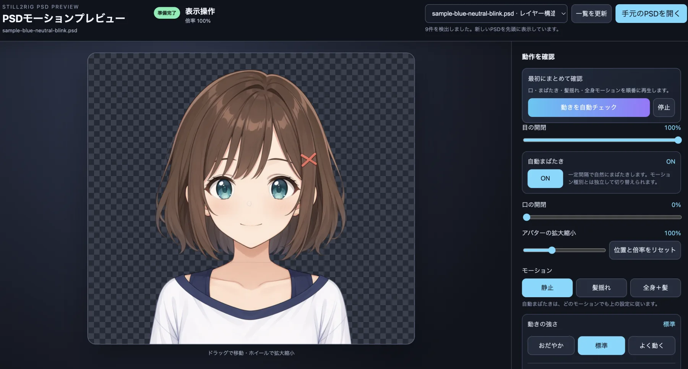

# Still2Rig PSD

1枚のアニメキャラクター静止画像を、Codexとユーザーが承認したGoogle Colab
GPUで分解し、構造検証済みPSDへ仕上げ、組み込みWebUIですぐに確認するための
プロジェクトです。

[English README](README.md)



生成したPSDを組み込みWebUIで読み込み、目・口の切り替え、自動まばたき、髪・全身の
動き、表示位置、拡大縮小を確認できます。

Still2Rig PSDは、Codexから使うことを前提にしています。画像を添付して変換を
依頼すると、Codexが作業の準備、承認済みColab上での処理、ダウンロード結果の
検証、PSD組み立て、品質確認まで進めます。Googleへのログイン、使用するChrome
プロファイル、GPU、Colab接続の承認はユーザーが管理します。

> **現在はv0.1 alphaです。** ニュートラルな静止画像1枚だけから、正しい閉じ目や
> 別の口形を常に生成できるわけではありません。不足している表情素材を
> プレースホルダーで隠さず、制作上の残作業として報告します。

## 使用している技術

- [See-through](https://github.com/shitagaki-lab/see-through)：静止画像を意味のある
  パーツごとに分離
- [Colab MCP Go](https://github.com/shinshin86/colab-mcp-go)：ユーザー承認後の
  Google ColabをCodexから操作
- ローカル処理：ハッシュ検証、レイヤー整理、PSD組み立て、構造品質の確認
- 組み込みWebUI：まばたき、口、全身、髪揺れ、ドラッグ、拡大縮小の確認と、
  前後の重なり修正・変更前比較・元PSDを残した別名保存

## はじめかた

### 1. 必要なものを用意する

- Codex CLI、IDE拡張、またはデスクトップアプリ
- Node.js 20.19以上
- Python 3.9以上とPillow
- Go 1.25以上
- L4ランタイムを利用できるGoogle Colabアカウント

プロジェクト直下で次を実行します。

```bash
npm install
python3 -m pip install -r requirements-local.txt
go install github.com/shinshin86/colab-mcp-go/cmd/colab-mcp-go@v0.0.0-20260824110853-5c9e997958bf
npm run doctor
```

Codexを起動する前に、`$(go env GOPATH)/bin`へ`PATH`が通っていることを確認して
ください。
インストールコマンドは、このプロジェクトで動作確認したColab MCP Goの版に固定
しています。

### 2. このプロジェクトでCodexを起動する

プロジェクト直下をCodexで開き、プロジェクト固有の`.codex/config.toml`を信頼
します。現在のセッションにColab MCPツールが表示されない場合は、一度Codexを
再起動してください。グローバルなCodex設定を書き換える必要はありません。
接続用のローカルポートは空いている番号が自動選択されるため、別のCodex
プロジェクトが起動したColab MCPとも共存できます。

Colab MCP Go本体は、このリポジトリに同梱していません。手順1でインストールした
`colab-mcp-go`を、プロジェクト設定から必要なときに起動します。このプロジェクトは、
すでに動いているグローバル側のプロセスを探して再利用するのではなく、専用の
プロセスを空きポートで起動します。ほかのプロセスを終了する必要はありません。
Codexの再起動が必要なのは、MCP設定を現在のセッションへ読み込ませる場合です。
PSDを作るたびに再起動する必要はありません。

### 3. 画像を渡してCodexへ依頼する

PNG、JPEG、WebPのアニメキャラクター画像を添付するか、ローカルファイルの場所を
伝えて、次のように依頼します。

```text
$still2rig-psd を使って、このアニメキャラクターの静止画像を、私が承認する
Google Colabセッション経由で検証済みレイヤーPSDに変換してください。
接続後は、結果の取り込み、PSD組み立て、品質確認まで進めて、最後にプレビューの
開き方を教えてください。
```

Codexは次の作業を進めます。

1. 画像をGit管理外の作業場所へコピーし、SHA-256を記録する
2. Colabで使うアップロード、準備、分離、ダウンロード用セルを生成する
3. トークン付きColab URLを表示し、ユーザーの接続承認を待つ
4. 承認されたL4ランタイムで、固定したSee-throughを実行する
5. ダウンロード結果を検証し、レイヤーを整理してPSDを組み立てる
6. 構造品質を確認し、生成PSDと残っている表情・動作上の課題を報告する

Colabが結果ZIPをブラウザへダウンロードしたあと、Codexがファイルを自動で
見つけられない場合は、ダウンロード先の場所を伝える必要があります。

Colab URLには接続用トークンが含まれます。公開、共有、スクリーンショットへの掲載は
しないでください。

### 4. 生成PSDを確認する

組み込みプレビューを起動します。

```bash
npm run preview
```

表示されたローカルURLを開いてください。WebUIは
`.still2rig-psd/jobs/*/output/`にある生成PSDを一覧表示し、最新結果を選択します。
手元にある別のPSDも、ファイル選択またはドラッグ＆ドロップで読み込めます。
生成済みPSDは「保存先を開く」から、Finderやエクスプローラーで出力フォルダを開けます。
「重なりを直す」では、人物上の直したい部分をクリックして選び、腕・手や前髪などを
手前／奥へ移動できます。重なった場所では候補から選び、変更前と比較してから、
元のPSDを上書きせず修正版を別ファイルとして保存できます。PSDの組み直しに時間が
かかる場合は、プレビュー上に処理中の内容を表示します。細かい並べ替えはPCのマウスで
右端の点々をドラッグして行えます。スマートフォンのタッチ操作には対応していません。

## 自動化される部分とユーザーが行う部分

| Codexが行うこと | ユーザーが行うこと |
| --- | --- |
| ローカル作業の準備とColab用セルの生成 | 使用するChromeプロファイルとGoogleアカウントの選択 |
| 接続承認後のSee-through実行 | Colab URLを開き、L4ランタイムを選択 |
| ダウンロード結果とハッシュの検証 | Colab MCP接続の承認 |
| レイヤー整理、PSD組み立て、構造品質の確認 | ランタイムを終了・削除するタイミングの判断 |
| 出力場所とプレビュー方法の報告 | 元画像にない正しい表情素材の用意 |

Still2Rig PSDは、Chromeの自動操作、Googleへのログイン、アカウント選択、ランタイム
割り当て、グローバルCodex設定の変更、Colabランタイムの終了・削除を行いません。

## 出力されるファイル

作業ごとのデータは、Git管理外の`.still2rig-psd/jobs/<名前>/`に保存されます。

```text
.still2rig-psd/jobs/<名前>/
  input/                 コピーした元画像
  colab/                 生成したColab用セル
  raw/imported/          検証済みのSee-through結果
  processed/layers/      整理したキャンバス全体のレイヤー
  output/<名前>.psd      組み立てたPSD
  reports/               コンタクトシートと品質確認結果
  job.json               ハッシュ、設定、処理記録
```

元画像、生成PSD、Colab接続トークン、ログ、スクリーンショット、動画、モデル、
ダウンロードZIPは、既定でGit管理対象外です。

## 品質確認と制限

現在のCLIが自動報告するのは、次のうち最初の2段階です。後の段階は前の段階を
満たしたうえで報告します。3段階目は、別途実装したレンダラー用アダプターで動きを
収録・評価した場合だけ使用します。

| 状態 | 意味 |
| --- | --- |
| **構造確認済み** | 設定順でPSDを書き出し、必須レイヤーと重要な前後関係の構造QAを通過済み。ハッシュは処理全体の別工程で確認します。 |
| **口・閉じ目ファイル自動検査済み** | `mouth_open`と`eye_close`があり、組み込みプレースホルダーではなく、位置合わせと口の数値検査を通過済み。絵として正しいかは目視確認が必要です。 |
| **アダプターによる動作確認済み** | 対象レンダラーで動きを収録し、定めた検査を通過済み。収録アダプターはまだ同梱していません。 |

標準の前後順は、奥から`back hair` → 下半身の服 → 腕 → 上半身の服 → 首 → 耳 →
顔 → 目・眉・鼻・口 → `front hair` → 頭の装飾です。横に下ろした腕を服より後ろへ置くため、今回の
ような肩口で腕が服を突き抜ける表示を防ぎます。ただし、胸の前へ出した手は同じ
順番では扱えません。その場合は腕を前後のパーツに分割する必要があります。

元画像に開き口や閉じ目が写っていない場合、本物の口・まばたき素材は自動では
確定できません。`--preview-placeholders`は操作確認用であり、実際の表情素材としては
扱いません。

詳しい前後順、必要な表情画像、各状態の判定範囲は
[生成されたPSDで確認できていること](docs/quality-gates.ja.md)を参照してください。
ワンクリックでLive2D制作が完成するとは保証しません。

## コマンドを直接使う場合

通常はリポジトリ内のスキルに従ってCodexが実行します。調査や手動操作では、次の
コマンドを直接利用できます。

```bash
npm run still2rig-psd -- prepare ./character.png --name demo
npm run still2rig-psd -- colab-url
npm run still2rig-psd -- status demo
npm run still2rig-psd -- import demo /path/to/still2rig-psd-demo.zip
npm run still2rig-psd -- finalize demo --expressions /path/to/expression-layers
npm run still2rig-psd -- repair demo --expressions /path/to/repaired-expression-layers
```

`repair` は検証済みの取り込み結果を再利用するため、Colab推論をやり直しません。
現在のPSDとレポートをGit管理外のジョブ領域へ退避し、隔離された修復領域で
再構築と構造QAを完了してから、WebUIが参照するPSDを更新します。

## セキュリティとプライバシー

- Colab MCPはlocalhostだけで待ち受け、ランダムな接続トークンを必要とします。
- 元画像と生成セルは、処理のためユーザーが承認したColabへ送信されます。ランタイムは
  ユーザーが終了するまで割り当てられたままです。
- 組み込みプレビューは`127.0.0.1`で待ち受け、Git管理外の生成PSDだけを提供します。
- 受け取ったZIPは信頼せず、パストラバーサル、シンボリックリンク、容量制限、
  ハッシュ不一致を検査します。
- 必要な権利を持たない元画像や生成物を公開しないでください。

詳細は[セキュリティ、プライバシー、承認境界](docs/security.md)を参照してください。

## ライセンス

Still2Rig PSDはMITライセンスです。See-throughとColab MCP Goは別個の
Apache-2.0プロジェクトです。プレビューにはMITライセンスのAnime2.5DRig
`rigger.js`をライセンス文とともに収録しています。外部ツールがダウンロードする
モデルには、追加の利用条件が設定されている場合があります。

第三者ライセンスについては[NOTICE.md](NOTICE.md)を参照してください。

## 関連ドキュメント

- [CodexとColabの処理手順](docs/codex-workflow.md)
- [構成と処理記録](docs/architecture.md)
- [生成されたPSDで確認できていること](docs/quality-gates.ja.md)
- [セキュリティ、プライバシー、承認境界](docs/security.md)
- [トラブルシューティング](docs/troubleshooting.md)
- [組み込みPSDプレビュー](webui/README.md)
